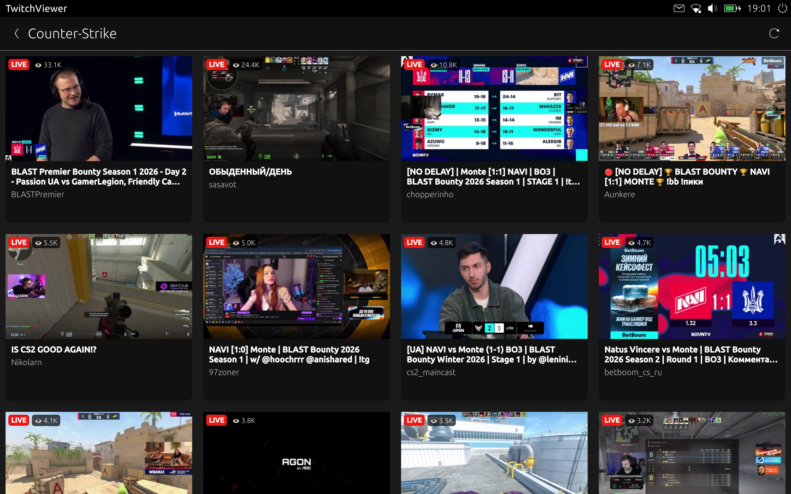
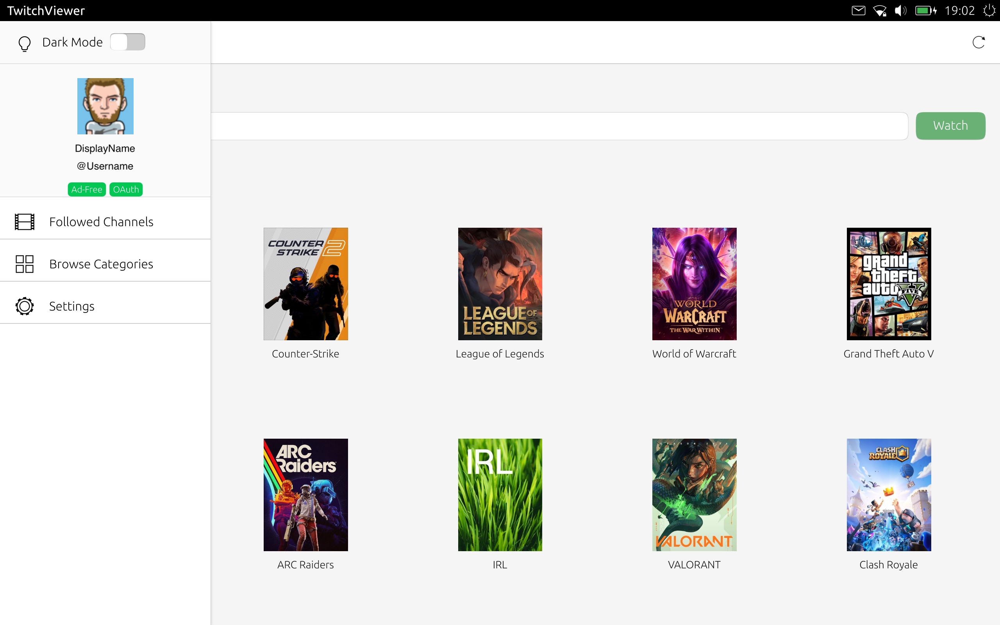
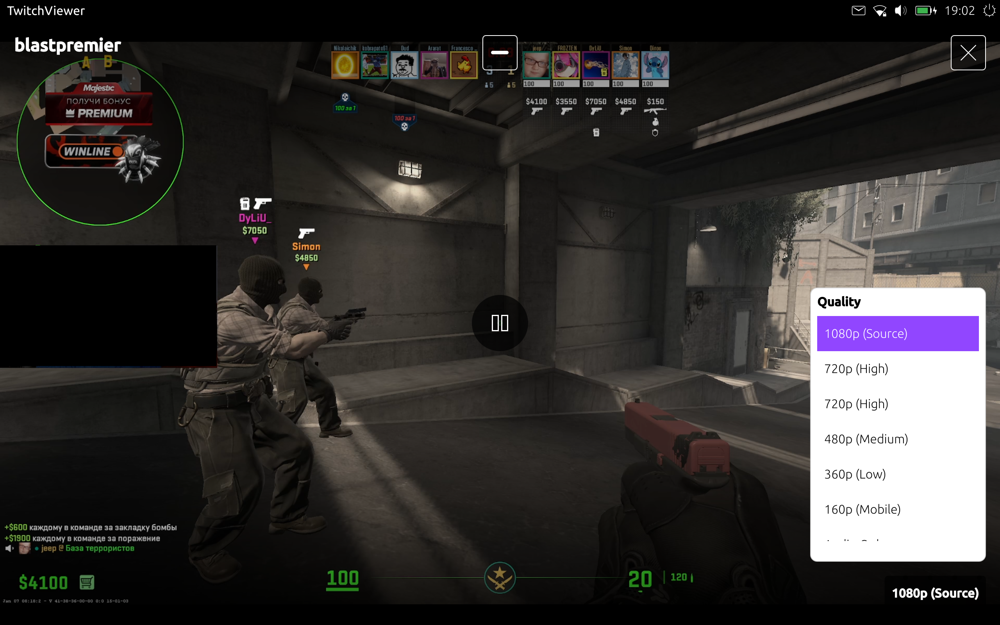
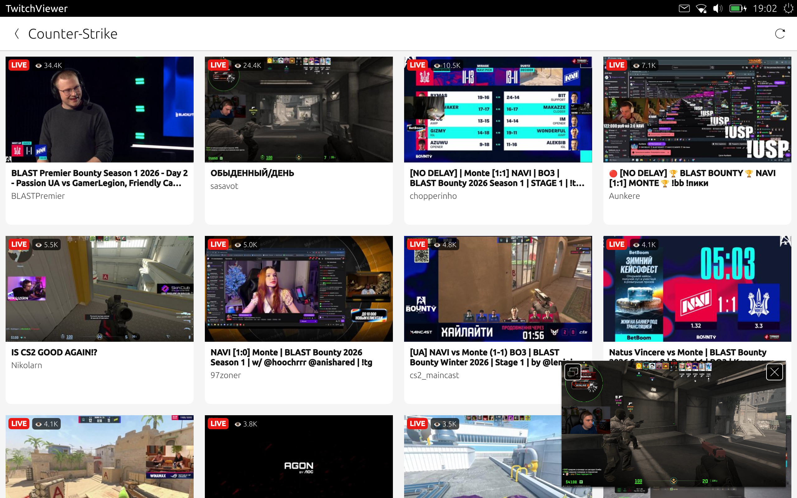
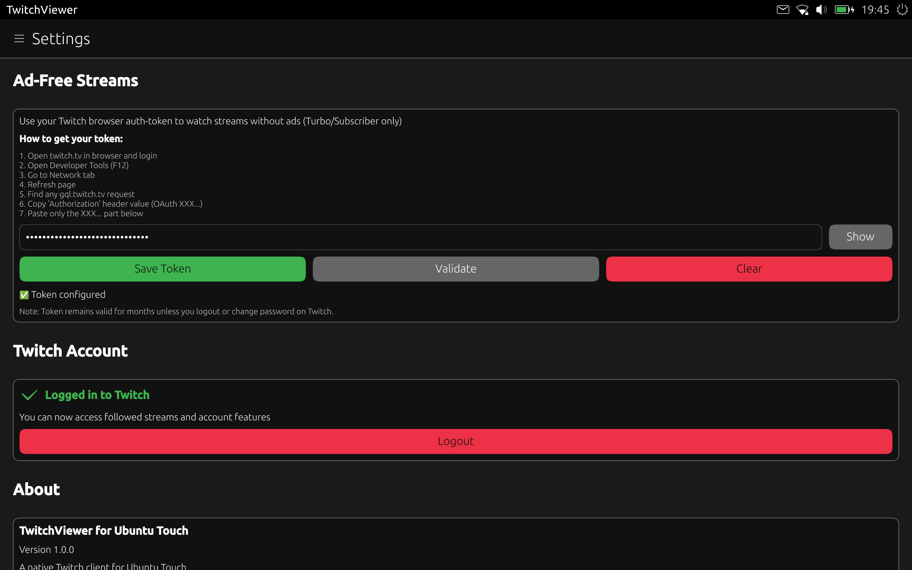

# TwitchViewer for Ubuntu Touch

A native Twitch client for Ubuntu Touch devices, allowing you to watch live streams and browse channels on your Ubuntu Touch phone or tablet.


<a href="https://next.open-store.io/app/twitchviewer.kallisto-app/" target=_blank>
  
</a>

## Screenshots

<table>
  <tr>
    <td></td>
    <td></td>
    <td></td>
  </tr>
  <tr>
    <td align="center"><b>Browse Live Streams</b></td>
    <td align="center"><b>Game Categories</b></td>
    <td align="center"><b>Quality Selection</b></td>
  </tr>
  <tr>
    <td></td>
    <td></td>
    <td></td>
  </tr>
  <tr>
    <td align="center"><b>Landscape Mode</b></td>
    <td align="center"><b>Settings & Authentication</b></td>
    <td></td>
  </tr>
</table>

## Features

- Browse and search for live Twitch channels
- **Secure OAuth login** using Twitch's Device Authorization Flow
- View your followed channels (when logged in)
- Watch live streams with quality selection (Auto, 1080p60, 720p60, 480p, 360p, 160p)
- Optional: Ad-free playback for Turbo/Subscriber users (Streamlink-based)
- Adaptive UI for both portrait and landscape modes
- Support for phones and tablets
- Pull-to-refresh for channel lists
- Native performance with Qt/QML

## Authentication & Privacy

### OAuth Login

The app uses a **registered Twitch Developer Application** with the official Device Authorization Flow. This means:

- Completely secure and official Twitch authentication
- No third-party services involved
- You log in directly through Twitch's website
- Your credentials never pass through the app
- Standard OAuth 2.0 Device Flow (same as used by TV apps)

### Ad-Free Stream Access (Advanced)

For users with **Twitch Turbo** or **channel subscriptions**, the app optionally supports authenticated playback using a method inspired by [Streamlink](https://github.com/streamlink/streamlink):

**How it works:**
1. Streamlink uses authenticated tokens to access ad-free stream variants
2. This requires manually providing an authentication token
3. The token is used only for media URL generation
4. Stored locally on your device

**Important Security Notice:**

This advanced feature is **completely optional** and separate from the OAuth login:

- Only needed if you want ad-free playback with Turbo/Subs
- Requires manual token setup (instructions in Settings)
- You provide the token at your own risk
- Token gives full account access - handle with care
- Can be revoked anytime at https://www.twitch.tv/settings/connections
- Not required for normal app functionality

**For most users:** The standard OAuth login is sufficient and recommended.

## Installation

### From OpenStore

1. Open the OpenStore app on your Ubuntu Touch device
2. Search for "TwitchViewer"
3. Install the app

### Manual Installation (Development)

```bash
# Install Clickable (if not already installed)
pip3 install --user clickable-ut

# Clone the repository
git clone https://github.com/KallistoX/twitchviewer.git
cd twitchviewer

# Build and deploy to device
clickable
```

## Building from Source

### Prerequisites

- Ubuntu (18.04 or later) or compatible Linux distribution
- Docker (for containerized builds)
- Clickable: `pip3 install --user clickable-ut`
- An Ubuntu Touch device with developer mode enabled

### Build Instructions

```bash
# Clone the repository
git clone https://github.com/KallistoX/twitchviewer.git
cd twitchviewer

# Build the app
clickable build

# Install to connected device
clickable install

# Build and install in one step
clickable
```

### Configuration (For Developers)

**Note for Users:** If you install from OpenStore, the app is pre-configured and ready to use. No configuration needed!

**For developers** building from source, you need your own Twitch Client ID:

```bash
# Copy the example config
cp config.cpp.example config.cpp

# Create a Twitch Developer Application:
# 1. Go to: https://dev.twitch.tv/console/apps
# 2. Register a new application
# 3. Copy your Client ID and paste it into config.cpp
```

**Important:** `config.cpp` is in `.gitignore` and should never be committed. Only commit changes to `config.cpp.example`.

## Usage

### Browsing Streams

1. Open the app
2. Browse popular streams or search for channels
3. Pull down to refresh the stream list
4. Tap on any stream to watch

### Quality Selection

- Tap the settings icon in the video player
- Choose from available quality options (Auto, 1080p60, 720p60, 480p, 360p, 160p)
- The player will switch quality without interrupting playback

### Authentication

#### OAuth Login (Recommended)

The app includes a secure OAuth login using Twitch's Device Authorization Flow:

1. Open the app and go to Settings
2. Tap "Login with Twitch"
3. You'll be redirected to Twitch in your browser
4. Log in and authorize the app
5. Return to the app - you're now logged in!

This allows you to:
- Access your followed channels
- See personalized recommendations
- No manual token handling required
- Completely secure (official Twitch OAuth)

**Revoking Access:**
- Visit https://www.twitch.tv/settings/connections
- Remove "TwitchViewer" from authorized apps

#### Advanced: Authentication Token for Ad-Free Streams (Optional)

**Only needed if you have Twitch Turbo or channel subscriptions and want ad-free playback.**

This uses a method inspired by [Streamlink](https://github.com/streamlink/streamlink) to access authenticated media links:

1. Go to Settings → "Ad-Free Playback"
2. Follow the in-app instructions to obtain an auth token
3. Enter the token in the app

**Important Security Notice:**
- This token provides full access to your Twitch account
- You use this at your own risk
- The token is stored locally on your device
- Only use this feature if you understand the implications
- This is separate from the OAuth login and not required for normal use

For detailed instructions, see the [Streamlink documentation](https://streamlink.github.io/cli/plugins/twitch.html#authentication)

## Technology Stack

- **Qt 5.12** - Application framework
- **QML** - User interface
- **C++** - Backend logic and API integration
- **QtMultimedia** - Video playback
- **QtNetwork** - HTTP requests and API calls

## Known Issues

- Chat integration is not yet implemented
- Some streams may require specific quality settings on older devices
- Ad-free auth token (for Turbo/Subs) must be manually entered

## Contributing

Contributions are welcome! Please see [CONTRIBUTING.md](CONTRIBUTING.md) for guidelines.

## Reporting Issues

If you encounter bugs or have feature requests:

1. Check if the issue already exists in [GitHub Issues](https://github.com/KallistoX/twitchviewer/issues)
2. If not, create a new issue with:
   - Device model and Ubuntu Touch version
   - App version
   - Steps to reproduce the problem
   - Expected vs actual behavior

## License

Copyright (C) 2025 Dominic Bussemas

This program is free software: you can redistribute it and/or modify it under the terms of the GNU General Public License version 3, as published by the Free Software Foundation.

This program is distributed in the hope that it will be useful, but WITHOUT ANY WARRANTY; without even the implied warranties of MERCHANTABILITY, SATISFACTORY QUALITY, or FITNESS FOR A PARTICULAR PURPOSE. See the GNU General Public License for more details.

You should have received a copy of the GNU General Public License along with this program. If not, see <http://www.gnu.org/licenses/>.

## Contact

- Developer: Dominic Bussemas
- Email: dev@bussemas.me
- GitHub Issues: https://github.com/KallistoX/twitchviewer/issues

## Acknowledgments

- Inspired by [Streamlink](https://github.com/streamlink/streamlink)
- Built with [Clickable](https://clickable-ut.dev/)
- Thanks to the Ubuntu Touch community

## Disclaimer

This app is not affiliated with, endorsed by, or sponsored by Twitch Interactive, Inc. Twitch and the Twitch logo are trademarks of Twitch Interactive, Inc.
